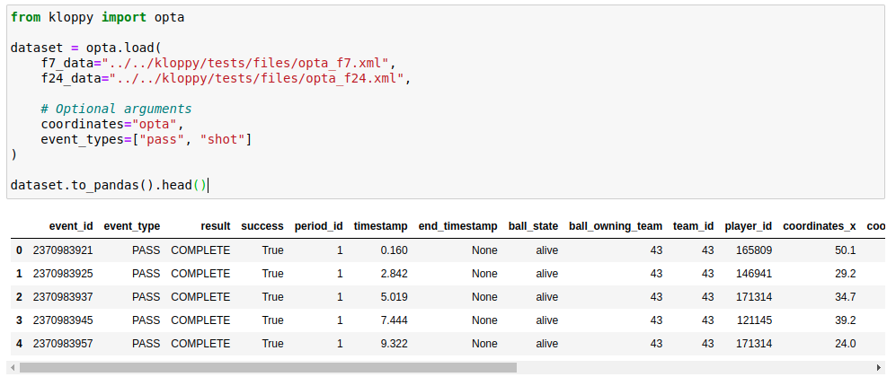

---
jupytext:
  formats: md:myst
  text_representation:
    extension: .md
    format_name: myst
    format_version: 0.13
    jupytext_version: 1.11.5
kernelspec:
  display_name: Python 3 (ipykernel)
  language: python
  name: python3
---

# The Kloppy Package

## What is Kloppy ?

As previously mentioned kloppy is a great package , It provides (de)serializers, standardized data models, filters, and transformers to facilitate work with different tracking and event data from various providers,So its main features are to load data and transform it into standardized models and vice versa.

## Kloppy providers
*The following table shows the providers supported by kloppy.*

|Provider|Format|
|--------|------|
|Datafactory|JSON|
|Metrica|JSON
|Opta|LXML|
|Sportec|LXML|
|Statsbomb|JSON|
|Wyscout|JSON|

To simplify the process, these providers display a different data structure within each format, "Kloppy" will proceed with each one to provide the same final result structure for each game. We will work with the events & line-up data.
## Example
to better understand what we are looking for as a result here an code example and its output.

## Kloppy Structure
"Kloppy" classifies events depending on the type of event.
* Events Types :

|Events Types|
|------------|
|Pass|
|Shot|
|Take on|
|Carry|
|Substitution|
|PlayerOn/Off|
|Card|
|Recovery|
|Ball Out|
|Foul Committed|
|Generic|

Each type of event will be qualified with one or more qualifiers.
* Qualifiers :

|Qualifiers||
|------------|-|
|Set Piece|Corner / FreeKick / Penalty /Throw in /KickOff|
|Body Part|Chest / Right Foot / Left Foot / Head|
|Pass Type|Cross / LongBall /ThroughBall / Launch / ChippedBall / Assist / 2nd Assist /SwitchOfPlay |
