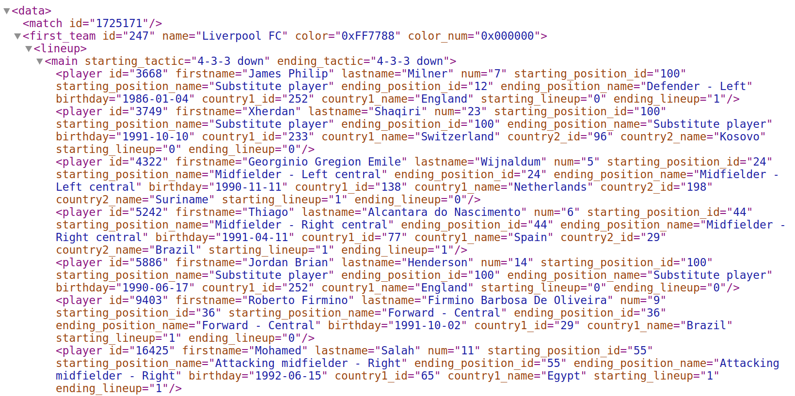
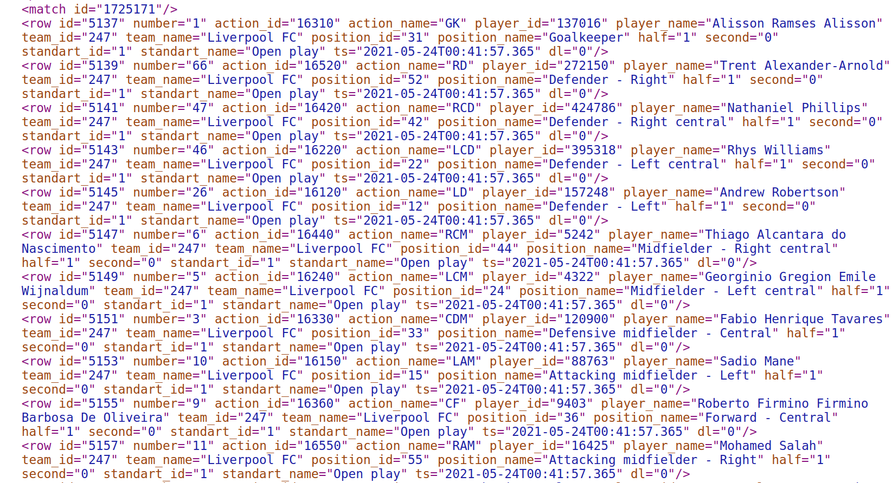
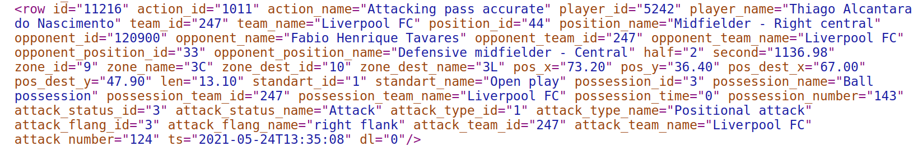

---
jupyter:
  jupytext:
    text_representation:
      extension: .md
      format_name: markdown
      format_version: '1.3'
      jupytext_version: 1.11.5
  kernelspec:
    display_name: Python 3 (ipykernel)
    language: python
    name: python3
---

<!-- #region -->
# The InStat provider

## What is InStat ?

InStat is a worldwide sports performance analysis company, it prepares statistics for pre-game analysis, collects data during games and breaks down the game after it is completed.
In our case we will use the events & the line-up data with an XML format file.

## InStat File Structure
### Line-up 
the line-up file consists of the match ID of the first team (home team) and the second team (away team) with its starting line-up with sub players.

*This a sample of the lineup XML file*

### Events

*This a sample of the events XML file*

Each row is considered an event that occurred within the match, every action has the following characteristics: time, type, place on the pitch, the player who committed it, the opponent (in the case of challenges).

*here an exemple of an event*

InStat has a specific way of structuring events as well as its type of action.
<!-- #endregion -->
